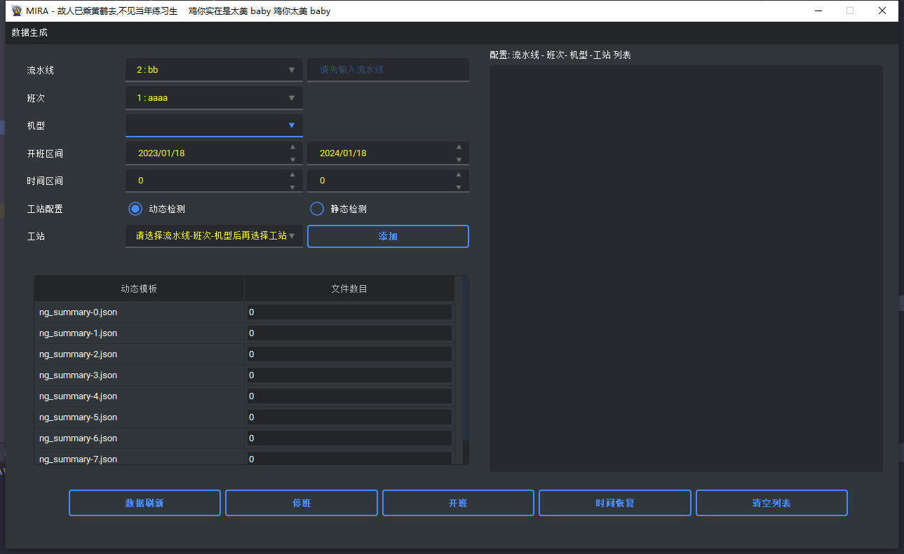
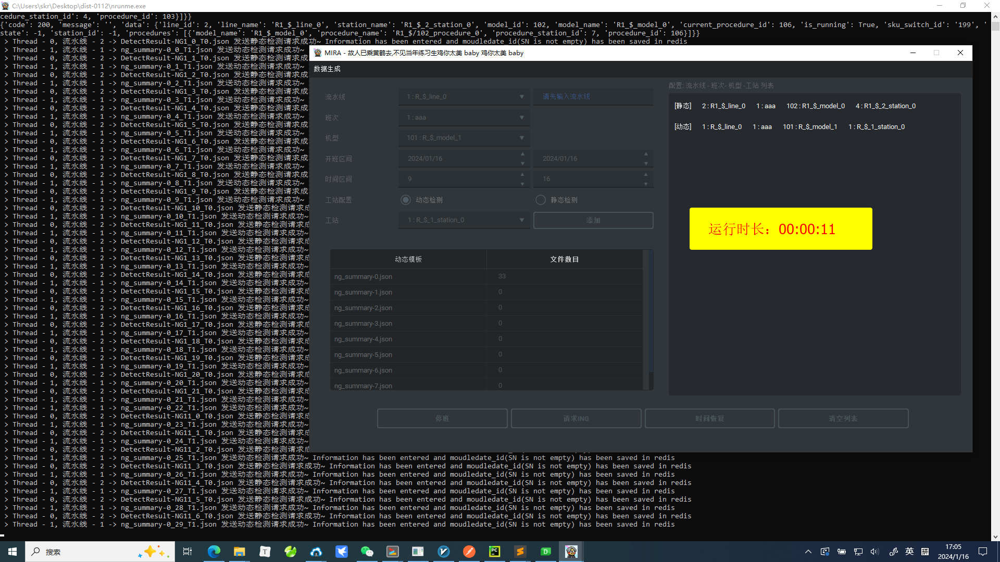

## mjk
+ my json data

## 使用说明

1. 窗体加载后点击 `获取下拉数据`
2. 在`流水线`下拉框中选择数据后, 会加载`工站`下拉框数据
3. 选择`工站`下拉框数据之后, `sku_switch`和`procedure`会发生变化
4. 在表格中`文件数目`中填入需要生成模板的文件数目
5. 点击`生成JSON`按钮
6. 等待数据生成之后, 可点击`发送请求`按钮进行检测数据上

## json字段生成规则
- session_start_time  
    ```
    手动输入
    ```

- session_end_time
    ```
    endTime + attendant_time
    ```

- operation_time

    ```
    模板序号<4; 56 ~ 65
    模板序号>=4; 66 ~ 80
    ```
- attendant_time  
    ```
    模板序号<4; 1 ~ 10
    模板序号>=4; 21 ~ 30
    ```
- startTime
  ```
  endTime - 10s	
  ```
- endTime
  ```
  session_start_time+result_detail.operation_time
  ```
- operationTime
  ```
  同operation_time
  ```

## 其他注意点
- 请在重新获取数据或者修改数据的情况下, 点击`生成json`, `发送请求`按钮

## 生成
```commandline
pyinstaller.exe -F .\runme.py --icon .\ico.ico 
```

## new 打包
```commandline
pyinstaller.exe -F .\urunme.py --icon .\ico.ico 
pyinstaller -F main.py
pyinstaller -F faker.py

-> 将main.exe和faker.exe放入core文件中

```

## 样式修改 （dark-blue）
```commandline
<!--?xml version="1.0" encoding="UTF-8"?-->
<resources>
  <color name="primaryTextColor">#ffff00</color>
  <color name="secondaryTextColor">#ffffff</color>
</resources>

```

## 示例

